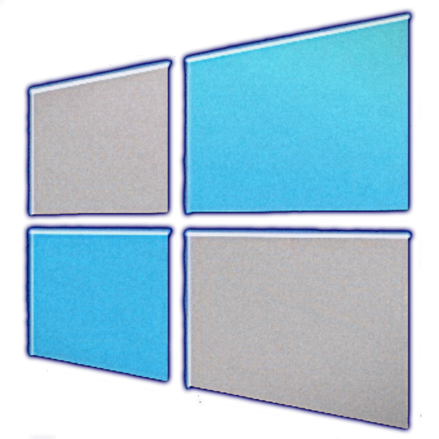
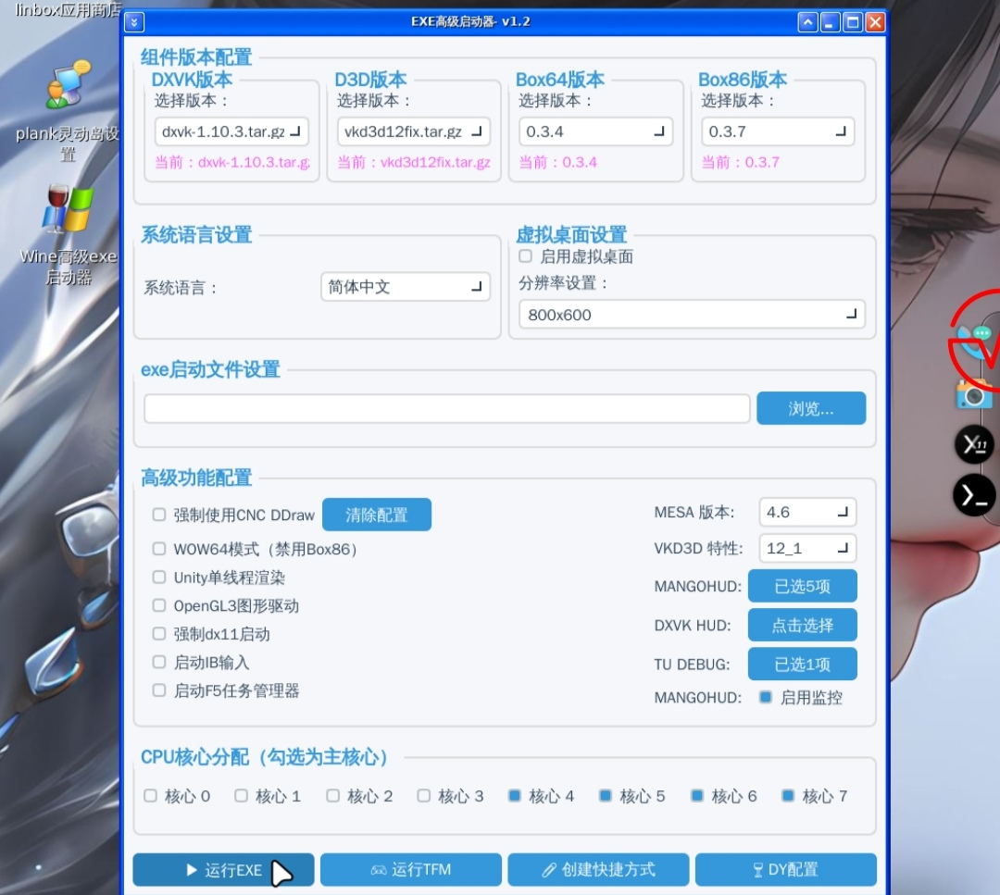

	  

# linbox
本仓库是安卓手机利用termux和x11实现debian运行mobox！起名字只是为了区分mobox！感谢mobox的所有开发人员！请支持原版mobox！并感谢所有大佬的帮助！
# 感谢*咔咔龙 *小白一枚 *云起云落 *Asia *Deemo *123 *等*以及mobox的所有开发人员！

	  

# 安装termux和termux-x11或者exa-x11
下载 [**termuxmod不需要x11**](https://github.com/afeimod/Debian-proot/releases/download/termux/termux_0.118mod.apk) 

下载 [**termux**](https://github.com/afeimod/Debian-proot/releases/download/termux/Termux_0.118.0+843d88c.apk) 

下载 [**termux-x11**](https://github.com/afeimod/Debian-proot/releases/download/termux/Termux_X11_1.03.00.apk) 

下载 [**exa-x11**](https://github.com/afeimod/Debian-proot/releases/download/termux/Exa_x11_v0.012.apk) 

下载 [**IB可竖屏Mod**](https://github.com/afeimod/Debian-proot/releases/download/termux/IB0.1.9.9.mod.apk) 

# 安装linbox

*1-直接国内网盘下载，分为 *百度网盘，*阿里云盘，*123盘！

*123盘

    https://www.123pan.com/s/K4clVv-0ghVH.html  提取码：y67N
    
*百度网盘

    https://pan.baidu.com/s/10q_Dj9r2gp9aRpmcrkU4oA?pwd=h6at 
    提取码:h6at

*2-github链接下载安装:更新较慢

链接 .[**linbox**](https://github.com/afeimod/linbox/releases/tag/linbox0.8). 

# 安装完后输入下面代码修复debian的root用户

    proot-distro login debian
    dpkg --configure -a
    apt reinstall sudo -y
    exit

