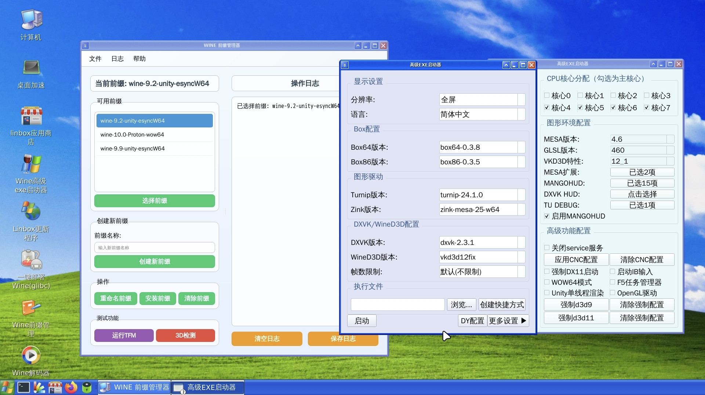

	  

# linbox
本仓库是安卓手机利用termux和x11实现debian运行mobox！起名字只是为了区分mobox！感谢mobox的所有开发人员！请支持原版mobox！并感谢所有大佬的帮助！
# 感谢*咔咔龙 *小白一枚 *云起云落 *Asia *Deemo *123 *等*以及mobox的所有开发人员！
# wine编译补丁参考https://github.com/Waim908/wine-termux

	  

# 安装termux和termux-x11或者exa-x11
下载 [**termuxmod不需要x11装完数据包后点重建依赖**](https://github.com/afeimod/Debian-proot/releases/download/termux/termux_0.118mod.apk) 

下载 [**termux**](https://github.com/afeimod/Debian-proot/releases/download/termux/Termux_0.118.0+843d88c.apk) 

下载 [**termux-x11**](https://github.com/afeimod/Debian-proot/releases/download/termux/Termux_X11_1.03.00.apk) 

下载 [**exa-x11**](https://github.com/afeimod/Debian-proot/releases/download/termux/Exa_x11_v0.012.apk) 

下载 [**IB可竖屏Mod**](https://github.com/afeimod/Debian-proot/releases/download/termux/IB0.1.9.9.mod.apk) 

# 安装linbox

*1-直接国内网盘下载，分为 *百度网盘，*阿里云盘，*123盘！

*123盘

    https://www.123pan.com/s/K4clVv-0ghVH.html  提取码：y67N
    
*百度网盘

    https://pan.baidu.com/s/10q_Dj9r2gp9aRpmcrkU4oA?pwd=h6at 
    提取码:h6at

*2-github链接下载安装:更新较慢

链接 .[**linbox**](https://github.com/afeimod/linbox/releases). 

# 安装完后输入下面代码修复debian的root用户

    proot-distro login debian
    dpkg --configure -a
    apt reinstall sudo -y
    exit

### 来源链接

* https://dl.winehq.org/wine/source
* https://github.com/olegos2/mobox
* https://github.com/Waim908/wine-termux
* https://github.com/wine-staging/wine-staging
* https://github.com/Frogging-Family/wine-tkg-git
* https://github.com/Kron4ek/wine-tkg
* https://github.com/ValveSoftware/wine
* https://github.com/varmd/wine-wayland
* https://github.com/Kron4ek/wine-wayland
* https://gitlab.collabora.com/alf/wine/-/tree/wayland

## 第三方应用程序

[glibc-packages](https://github.com/termux-pacman/glibc-packages)

[Box64](https://github.com/ptitSeb/box64)

[Box86](https://github.com/ptitSeb/box86)

[DXVK](https://github.com/doitsujin/dxvk)

[DXVK-ASYNC](https://github.com/Sporif/dxvk-async)

[DXVK-GPLASYNC](https://gitlab.com/Ph42oN/dxvk-gplasync)

[VKD3D](https://github.com/lutris/vkd3d)

[D8VK](https://github.com/AlpyneDreams/d8vk)

[Termux-app](https://github.com/termux/termux-app)

[Termux-x11](https://github.com/termux/termux-x11)

[Wine](https://wiki.winehq.org/Licensing)

[wine-ge-custom](https://github.com/GloriousEggroll/wine-ge-custom)

[Mesa](https://docs.mesa3d.org/license.html)

[mesa-zink-11.06.22](https://github.com/alexvorxx/mesa-zink-11.06.22)

[Mesa-VirGL](https://github.com/alexvorxx/Mesa-VirGL)
